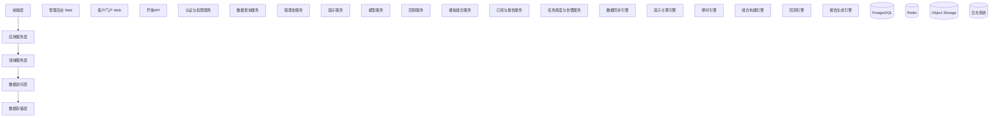
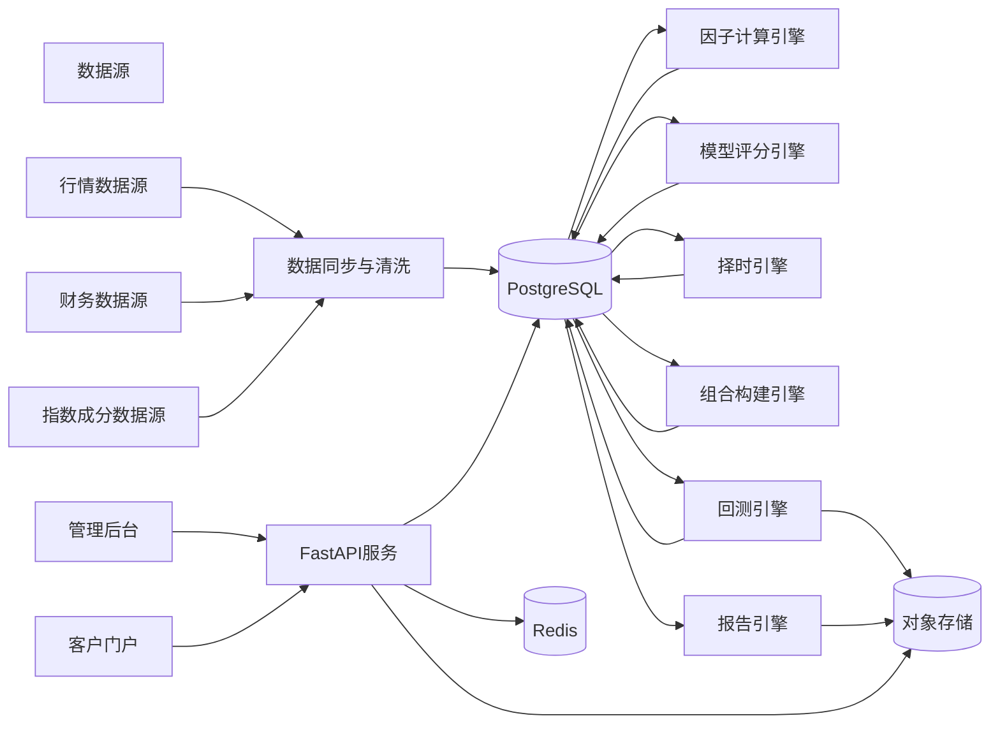
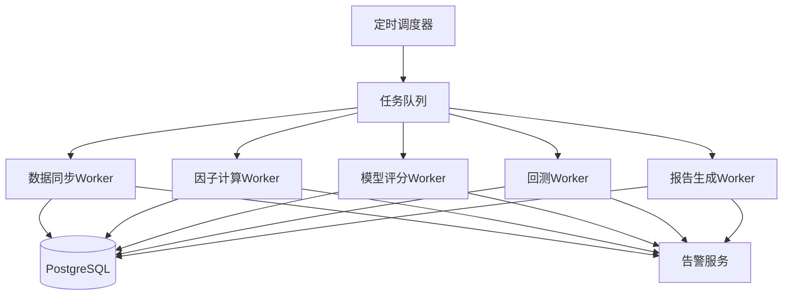
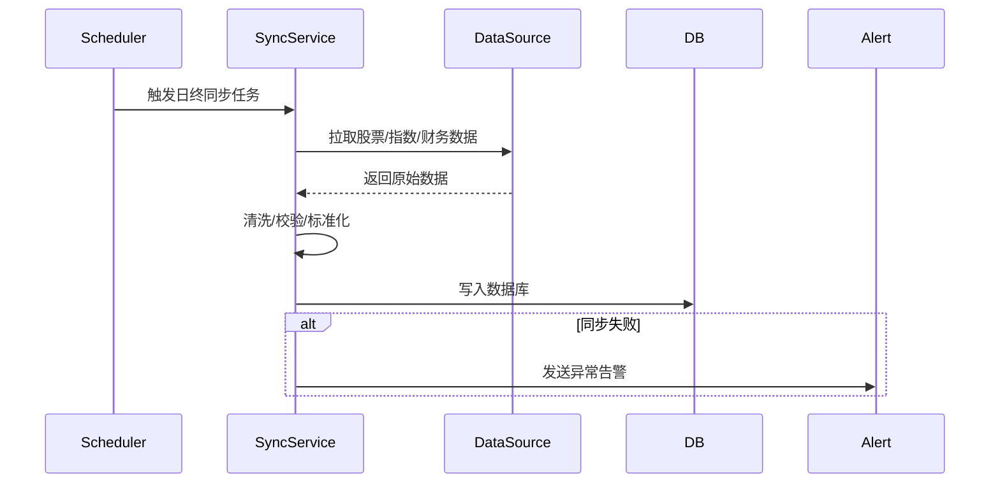
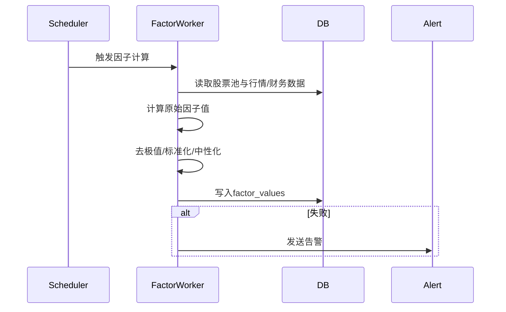
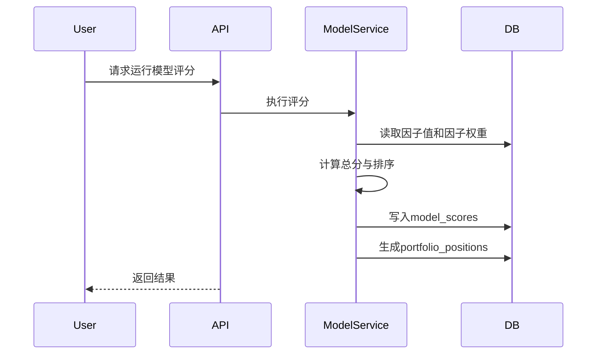
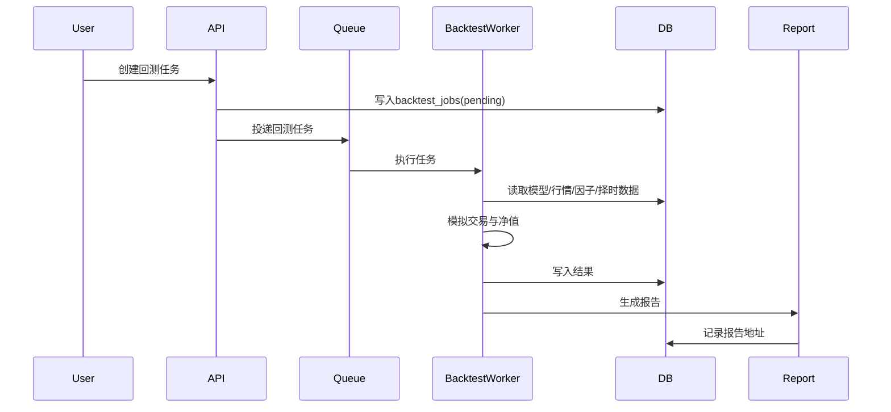
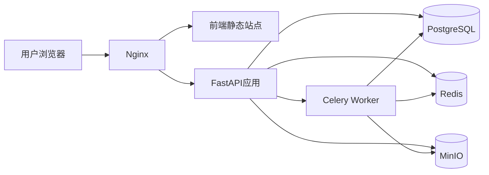

# 二、《A股多因子增强策略平台 系统架构图与技术设计文档》

**文档版本**：V1.0  
**适用范围**：MVP / V2.0  
**目标**：定义系统总体架构、模块划分、技术选型、关键流程与部署方案

---

# 1. 架构目标

本系统架构应满足：

1. 支持 A 股多因子增强策略研究与交付闭环
2. 满足时点回溯和可复现实验要求
3. 支持数据同步、因子计算、模型评分、回测、模拟组合
4. 支持客户订阅和策略报告交付
5. 支持后续扩展到更丰富因子、择时、归因和API服务

---

# 2. 总体技术架构

## 2.1 架构分层



---

# 3. 模块划分

## 3.1 前端层

### 管理后台
面向管理员、研究员、组合经理使用，主要功能：
- 数据管理
- 股票池管理
- 因子管理
- 模型配置
- 回测管理
- 模拟组合管理
- 订阅与报告管理
- 告警与日志查看

### 客户门户
面向订阅客户，主要功能：
- 查看策略产品
- 查看当前组合
- 查看历史调仓
- 查看策略报告
- 查看订阅状态

---

## 3.2 应用服务层

主要职责：
- 提供 REST API
- 参数校验
- 权限校验
- 业务流程编排
- 异步任务触发
- 响应组装

建议技术：
- **FastAPI**

---

## 3.3 领域服务层

### 数据同步引擎
职责：
- 同步股票基础资料
- 同步日线行情
- 同步指数成分股
- 同步财务数据
- 同步交易状态

### 因子计算引擎
职责：
- 根据交易日和股票池批量计算因子
- 进行去极值、标准化、中性化
- 写入因子值表

### 择时引擎
职责：
- 基于指数价格计算 120 日均线信号
- 输出风险暴露比例

### 组合构建引擎
职责：
- 合成多因子总分
- 排名选股
- 按约束生成目标持仓
- 生成调仓建议

### 回测引擎
职责：
- 按交易日模拟策略运行
- 处理 A 股规则
- 生成净值和交易明细

### 报告生成引擎
职责：
- 生成 PDF / HTML / JSON 报告
- 输出给管理后台和客户端

---

# 4. 核心架构图

## 4.1 业务架构图



---

## 4.2 任务执行架构图



---

# 5. 技术选型建议

## 5.1 后端
- **Python 3.11+**
- **FastAPI**
- **SQLAlchemy 2.x**
- **Alembic**
- **Pydantic**
- **Celery / R / APScheduler**
- **Pandas / NumPy**
- **Polars（可选）**
- **PyArrow（可选）**

## 5.2 前端
- **Vue 3 + Element Plus**
或
- **React + Ant Design**

，后台建议：
- **Vue 3 + Element Plus**

## 5.3 数据库与缓存
- **PostgreSQL**：业务主库
- **Redis**：缓存、分布式锁、短任务状态
- **MinIO / S3**：报告文件、导出文件

## 5.4 性能指标与容量规划

### 5.4.1 性能要求
- **API响应时间**：核心接口 < 200ms，复杂查询 < 1s
- **因子计算**：单交易日全市场因子计算 < 10分钟
- **回测任务**：1年数据回测 < 30分钟
- **并发用户**：支持 100 并发用户访问
- **数据同步**：日终数据同步 < 2小时

### 5.4.2 容量规划
- **数据存储**：支持 10 年 A 股日线数据（约 5000 万条记录）
- **因子存储**：支持 50+ 因子，10 年历史数据
- **模型存储**：支持 100+ 策略模型
- **报告存储**：支持 1000+ 历史报告文件
- **用户容量**：支持 1000+ 注册用户

### 5.4.3 监控指标
- **系统健康度**：CPU < 70%，内存 < 80%，磁盘 < 70%
- **数据库连接**：活跃连接数 < 50
- **任务队列**：积压任务 < 10
- **API错误率**：错误率 < 1%

## 5.4 任务调度
- MVP 推荐：
  - **APScheduler**：定时任务
  - **Celery + Redis**：异步任务

## 5.5 部署
- **Docker Compose**
- **Nginx**
- 后期可扩展到：
  - Kubernetes
  - Prometheus + Grafana
  - ELK/Loki

---

# 6. 关键业务流程设计

## 6.1 数据同步流程



### 说明
- 日终执行
- 必须记录同步日志
- 同步异常要重试

---

## 6.2 因子计算流程



---

## 6.3 模型评分与组合生成流程



---

## 6.4 回测流程



---

# 7. 核心技术设计

## 7.1 数据时点一致性设计

这是 A 股多因子系统最关键的一点。

### 要求
- 使用 `trade_date` 作为横轴
- 财务数据必须按 `available_date <= trade_date` 使用
- 股票池必须按当日成分和过滤状态生成
- 因子值必须按交易日落库快照
- 组合和调仓必须按快照复现

### 原则
任何回测或评分任务，都不得直接查询“当前最新财务数据”。

---

## 7.2 因子计算设计

### 基本步骤
1. 读取股票池快照
2. 读取行情和财务原始数据
3. 计算原始因子值
4. 去极值
5. 标准化
6. 行业中性化（MVP可简化）
7. 写入 `factor_values`

### 设计建议
- 因子计算按交易日批处理
- 支持重算单日
- 支持单因子回算

---

## 7.3 模型评分设计

### 评分公式
MVP 可采用：
```text
TotalScore = Σ (FactorWeight_i × StandardizedFactor_i)
```

### 选择逻辑
- 对所有可投资股票排序
- 取前 N 名
- 叠加择时仓位
- 等权分配

---

## 7.4 择时引擎设计

### MVP规则
```text
if benchmark_close > MA120:
    exposure = 1.0
else:
    exposure = 0.5
```

### 输入
- 指数日线数据

### 输出
- `timing_signals`

---

## 7.5 回测引擎设计

### 交易规则
- 收盘后生成信号
- 下一个交易日开盘成交
- 卖出收印花税
- 买卖收佣金
- 100股整数倍
- 停牌不能成交
- 涨跌停时按规则决定是否成交
- T+1 限制卖出

### 回测循环
按交易日迭代：
1. 更新市场数据
2. 判断是否调仓日
3. 生成目标持仓
4. 计算订单
5. 撮合成交
6. 更新仓位和现金
7. 记录净值

---

## 7.6 报告生成设计

### 报告内容
- 策略概览
- 因子说明
- 基准对比
- 净值曲线
- 回撤曲线
- 月度收益
- 调仓记录
- 风险提示

### 输出方式
- JSON 供前端展示
- HTML 模板
- PDF 导出

---

# 8. 系统目录结构建议

以下以 FastAPI 单体模块化项目为例：

```text
app/
├── api/
│   ├── v1/
│   │   ├── auth.py
│   │   ├── users.py
│   │   ├── securities.py
│   │   ├── market.py
│   │   ├── stock_pools.py
│   │   ├── factors.py
│   │   ├── models.py
│   │   ├── timing.py
│   │   ├── portfolios.py
│   │   ├── backtests.py
│   │   ├── simulated_portfolios.py
│   │   ├── products.py
│   │   ├── subscriptions.py
│   │   ├── reports.py
│   │   ├── task_logs.py
│   │   └── alert_logs.py
├── core/
│   ├── config.py
│   ├── security.py
│   ├── logger.py
│   └── exceptions.py
├── db/
│   ├── session.py
│   ├── base.py
│   └── models/
├── schemas/
├── services/
│   ├── auth_service.py
│   ├── market_service.py
│   ├── stock_pool_service.py
│   ├── factor_service.py
│   ├── model_service.py
│   ├── timing_service.py
│   ├── portfolio_service.py
│   ├── backtest_service.py
│   ├── simulated_portfolio_service.py
│   ├── report_service.py
│   └── subscription_service.py
├── workers/
│   ├── celery_app.py
│   ├── data_sync_tasks.py
│   ├── factor_tasks.py
│   ├── model_tasks.py
│   ├── backtest_tasks.py
│   └── report_tasks.py
├── utils/
├── templates/
├── tests/
└── main.py
```

---

# 9. 部署架构建议

## 9.1 MVP部署图



---

## 9.2 Docker Compose 组件建议
- nginx
- frontend
- backend
- worker
- postgres
- redis
- minio

---

# 10. 安全与权限设计

## 10.1 认证
- JWT Access Token
- Refresh Token

## 10.2 权限
- RBAC 角色权限
- 产品订阅权限校验
- 报告访问权限校验

## 10.3 安全措施
- 密码哈希存储
- 敏感配置环境变量管理
- 操作日志审计
- 限流
- CORS 白名单

---

# 11. 监控与告警设计

## 11.1 监控内容
- API 响应时间
- 回测任务状态
- 数据同步成功率
- 因子计算成功率
- Worker 任务积压
- 数据库连接状态

## 11.2 告警场景
- 数据同步失败
- 因子计算失败
- 回测失败
- 报告生成失败
- Redis/PostgreSQL 不可用

## 11.3 告警方式
- 邮件
- 企业微信/飞书 webhook
- 日志告警

---

# 12. 性能与扩展建议

## 12.1 MVP阶段
- 优先保证可用性和可复现性
- 不急于微服务拆分
- 使用单体模块化架构即可

## 12.2 后续扩展
- 将因子计算迁移到独立计算服务
- 将回测明细迁移到 ClickHouse
- 增加归因分析服务
- 增加开放 API 网关

---

# 13. 技术风险与应对

| 风险 | 描述 | 应对 |
|---|---|---|
| 数据未来函数 | 财务数据使用不当 | 严格按 available_date 回溯 |
| 回测过慢 | 数据量扩大后效率不足 | 增量缓存、任务并发、优化SQL |
| 因子失效 | 某些因子阶段失效 | 加入因子分析与版本管理 |
| 报告生成复杂 | 图表和导出耗时 | JSON与PDF分离生成 |
| 权限绕过 | 客户越权访问产品 | 每个产品接口强制订阅校验 |